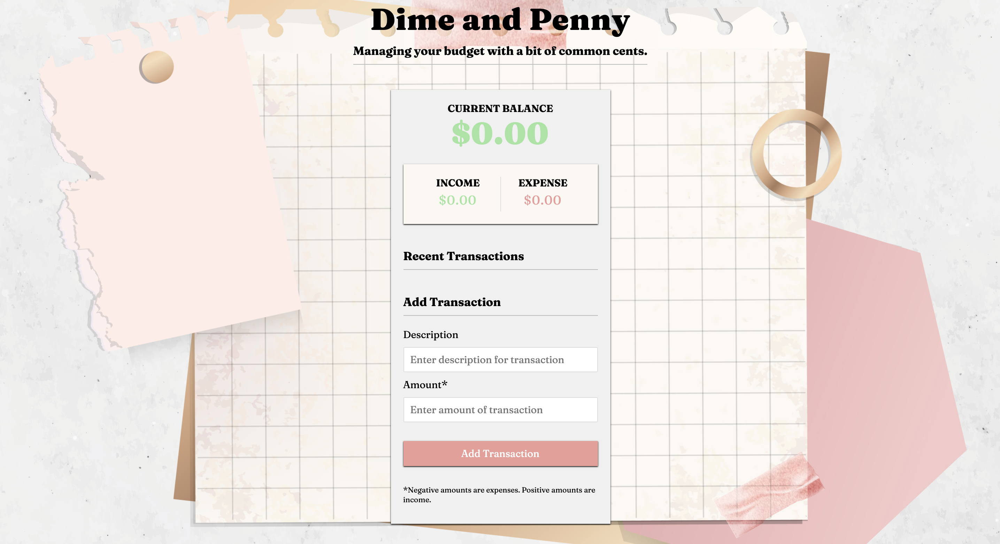

# Dime and Penny


[](https://opensource.org/licenses/MIT)

## Table of Contents

- [Description](#description)
- [User Story](#user-story)
- [Features of the Application](#features-of-the-application)
- [Preview of Dime and Penny](#preview-of-dime-and-penny)
- [Links](#links)
- [Built Using](#built-using)
- [License](#license)

## Description

Dime and Penny is a mobile-responsive, budget tracking application. (It is built with plain JavaScript (no frameworks or libraries), inspired by [Dime and Nickel](https://github.com/rh9891/DimeAndNickel).) The dynamically updated application manipulates the DOM through its utilization of array methods (`filter()` and `reduce()` methods) and localStorage.

## User Story

```
AS A user  
I WANT to track items I purchase and their cost  
SO THAT I can manage my daily spending efficiently.
```

## Features of the Application

```
GIVEN an expense-tracking application  
WHEN I want to add an income  
THEN I insert a positive amount with a description and add the transaction.

WHEN I want to track an expense  
THEN I insert a negative amount with a description and add the transaction.

WHEN I add an expense  
THEN the transaction is displayed under "Recent Transactions" and marked in red.

WHEN I add an income  
THEN the transaction is displayed under "Recent Transactions" and marked in green.

WHEN I hover over a listed transaction  
THEN an X will be displayed that can be clicked to delete the transaction.

WHEN I fail to input a transaction description and/or amount  
THEN an alert is displayed describing the error.
```

## Preview of Dime and Penny



## Links

- [Deployed Application](https://rh9891.github.io/DimeAndPenny/)

- [Github Repository](https://github.com/rh9891/DimeAndPenny)

## Built Using

Listed below are the guides that made building this application possible:

- [Array filter() Method](https://www.w3schools.com/jsref/jsref_filter.asp)
- [Array reduce() Method](https://www.w3schools.com/jsref/jsref_reduce.asp)
- [How to Create A Snackbar](https://www.w3schools.com/howto/howto_js_snackbar.asp)
- [localStorage Property](https://www.w3schools.com/jsref/prop_win_localstorage.asp)

## License

The MIT License (MIT)

Copyright (c) 2021 Romie Hecdivert

Permission is hereby granted, free of charge, to any person obtaining a copy of this software and associated documentation files (the "Software"), to deal in the Software without restriction, including without limitation the rights to use, copy, modify, merge, publish, distribute, sublicense, and/or sell copies of the Software, and to permit persons to whom the Software is furnished to do so, subject to the following conditions:

The above copyright notice and this permission notice shall be included in all copies or substantial portions of the Software.

THE SOFTWARE IS PROVIDED "AS IS", WITHOUT WARRANTY OF ANY KIND, EXPRESS OR IMPLIED, INCLUDING BUT NOT LIMITED TO THE WARRANTIES OF MERCHANTABILITY, FITNESS FOR A PARTICULAR PURPOSE AND NONINFRINGEMENT. IN NO EVENT SHALL THE AUTHORS OR COPYRIGHT HOLDERS BE LIABLE FOR ANY CLAIM, DAMAGES OR OTHER LIABILITY, WHETHER IN AN ACTION OF CONTRACT, TORT OR OTHERWISE, ARISING FROM, OUT OF OR IN CONNECTION WITH THE SOFTWARE OR THE USE OR OTHER DEALINGS IN THE SOFTWARE.